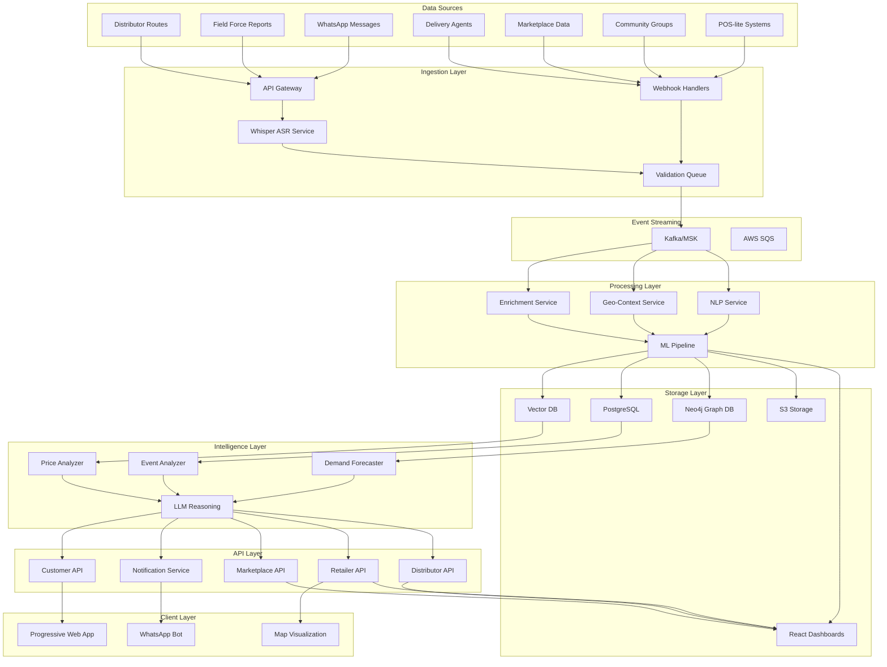

# Design Document: Retail Agent Intelligence (RAI)

## Overview

The Retail Agent Intelligence (RAI) platform is designed as a cloud-native, event-driven system that captures ground-reality signals from India's fragmented retail ecosystem and transforms them into actionable hyperlocal intelligence. The system leverages a hybrid data architecture combining graph databases, relational storage, and vector databases to model complex retail relationships while providing real-time insights through AI/ML processing.

The platform addresses the unique challenges of the Indian retail market where 90% of products are unbranded, relationships drive commerce, and millions of micro-retailers operate with minimal digital infrastructure. By supporting WhatsApp-based interactions, multilingual voice processing, and offline-capable interfaces, RAI bridges the digital divide while delivering enterprise-grade intelligence.

## Architecture

### High-Level Architecture



### Event-Driven Architecture Pattern

The system follows an event-driven architecture using Apache Kafka (AWS MSK) as the central message broker. This pattern enables:

- **Loose coupling** between components for independent scaling and deployment
- **Real-time processing** of retail signals as they arrive
- **Event sourcing** for audit trails and system replay capabilities
- **Resilient processing** with automatic retry and dead letter queues

Key event types include:
- `signal.ingested` - Raw signal received and validated
- `signal.processed` - Signal enriched with NLP and geo-context
- `insight.generated` - AI-generated insight available
- `demand.predicted` - Demand forecast updated
- `alert.triggered` - Anomaly or threshold breach detected

## Components and Interfaces

### 1. Ingestion Gateway

**Purpose**: Unified entry point for all external data sources with protocol adaptation and initial validation.

**Components**:
- **AWS API Gateway**: REST endpoints for structured data sources
- **WhatsApp Cloud API Integration**: Direct webhook for WhatsApp Business messages
- **Whisper ASR Service**: Speech-to-text conversion for voice inputs
- **Validation Service**: Schema validation and data quality checks

**Key Interfaces**:
```python
# Signal ingestion interface
class SignalIngestionService:
    def ingest_whatsapp_message(self, message: WhatsAppMessage) -> SignalEvent
    def ingest_field_report(self, report: FieldReport) -> SignalEvent
    def ingest_voice_input(self, audio: AudioData) -> SignalEvent
    def validate_signal(self, signal: RawSignal) -> ValidationResult
```

**Technology Stack**: Python FastAPI, AWS API Gateway, OpenAI Whisper, Pydantic validation

### 2. Signal Processing Engine

**Purpose**: Extract structured information from unstructured signals using NLP and contextual enrichment.

**Components**:
- **NLP Extraction Service**: Product, brand, price, quantity extraction
- **Geo-Context Resolver**: Street/pincode level location resolution
- **Entity Resolution Service**: Normalize and deduplicate entities
- **Trend Detection Service**: Identify patterns and velocity changes

**Key Interfaces**:
```python
class SignalProcessor:
    def extract_entities(self, text: str, language: str) -> ExtractedEntities
    def resolve_location(self, location_hint: str) -> GeoContext
    def normalize_product(self, product_mention: str) -> ProductEntity
    def detect_trends(self, signals: List[Signal]) -> TrendAnalysis
```

**Technology Stack**: HuggingFace Transformers, spaCy, Python, AWS Lambda

### 3. Hybrid Knowledge Storage

**Purpose**: Optimized storage for different data types and access patterns.

#### Neo4j Retail Knowledge Graph
**Schema Design**:
```cypher
// Core entities
(Store)-[:LOCATED_IN]->(Location)
(Store)-[:SELLS]->(Product)
(Product)-[:BELONGS_TO]->(Brand)
(Product)-[:IN_CATEGORY]->(Category)
(Event)-[:AFFECTS]->(Location)
(Event)-[:INFLUENCES]->(Product)
(Distributor)-[:SERVES]->(Store)
(FieldAgent)-[:COVERS]->(Location)

// Relationship properties for analytics
(:Store)-[:SELLS {price: float, availability: boolean, last_updated: datetime}]->(:Product)
(:Event)-[:INFLUENCES {impact_score: float, duration: int}]->(:Product)
```

#### PostgreSQL Relational Schema
```sql
-- Core metadata tables
CREATE TABLE stores (
    id UUID PRIMARY KEY,
    name VARCHAR(255),
    type VARCHAR(50),
    location_id UUID,
    created_at TIMESTAMP,
    metadata JSONB
);

CREATE TABLE products (
    id UUID PRIMARY KEY,
    name VARCHAR(255),
    brand_id UUID,
    category_id UUID,
    attributes JSONB
);

CREATE TABLE signals (
    id UUID PRIMARY KEY,
    source_type VARCHAR(50),
    raw_data JSONB,
    processed_data JSONB,
    timestamp TIMESTAMP,
    location_context JSONB
);
```

#### Vector Database (Pinecone/Chroma)
**Purpose**: Semantic similarity search for products, trends, and insights
- Product embeddings for similarity matching
- Trend pattern embeddings for anomaly detection
- Customer query embeddings for intelligent search

**Key Interfaces**:
```python
class HybridStorage:
    def store_retail_relationship(self, relationship: RetailRelationship) -> None
    def query_product_network(self, product_id: str, depth: int) -> ProductNetwork
    def find_similar_trends(self, trend_vector: np.ndarray) -> List[SimilarTrend]
    def get_hyperlocal_context(self, location: GeoPoint) -> HyperlocalContext
```

### 4. AI Intelligence Engine

**Purpose**: Generate actionable insights using machine learning and LLM reasoning.

**Components**:

#### Demand Forecasting Service
- **Models**: ARIMA for seasonal patterns, LSTM for complex sequences, XGBoost for feature-rich predictions
- **Features**: Historical demand, events, weather, festivals, local trends
- **Output**: Hyperlocal demand predictions with confidence intervals

#### Event Impact Analyzer
- **Purpose**: Predict demand uplift from local events (festivals, community gatherings)
- **Approach**: Event-demand correlation analysis with geographic weighting
- **Models**: Gradient boosting with event embeddings

#### Price Intelligence Service
- **Purpose**: Price sensitivity and elasticity modeling
- **Approach**: Multi-level modeling (product, location, time)
- **Output**: Optimal pricing recommendations and competitive analysis

#### LLM Reasoning Engine
- **Purpose**: Synthesize insights and generate natural language recommendations
- **Model**: GPT-4 with retail domain fine-tuning
- **Context**: Graph queries, statistical analysis, trend data

**Key Interfaces**:
```python
class IntelligenceEngine:
    def forecast_demand(self, product: str, location: str, horizon: int) -> DemandForecast
    def analyze_event_impact(self, event: Event, location: str) -> ImpactAnalysis
    def generate_insights(self, context: BusinessContext) -> List[Insight]
    def recommend_actions(self, situation: BusinessSituation) -> List[Recommendation]
```

### 5. API Service Layer

**Purpose**: Role-aware and locality-aware APIs for different user types.

**Microservices Architecture**:
- **Retailer Intelligence API**: Store-specific insights, inventory recommendations
- **Distributor Optimization API**: Route planning, demand aggregation
- **Marketplace Intelligence API**: Trend analysis, competitive insights
- **Customer Discovery API**: Store finder, product availability
- **Notification Service**: WhatsApp message delivery

**Authentication & Authorization**:
- JWT-based authentication with role-based access control
- Location-based data filtering for privacy and relevance
- API rate limiting and usage analytics

**Key Interfaces**:
```python
class RetailerAPI:
    def get_store_insights(self, store_id: str, user_context: UserContext) -> StoreInsights
    def get_demand_forecast(self, products: List[str], location: str) -> ForecastData
    def get_inventory_recommendations(self, store_id: str) -> InventoryAdvice

class DistributorAPI:
    def optimize_routes(self, distributor_id: str, date: datetime) -> RouteOptimization
    def get_demand_aggregation(self, region: str, products: List[str]) -> AggregatedDemand
```

### 6. Client Applications

#### React Dashboards
- **Retailer Dashboard**: Sales analytics, inventory insights, demand forecasts
- **Distributor Dashboard**: Route optimization, delivery analytics, demand heatmaps
- **Marketplace Dashboard**: Trend intelligence, competitive analysis, market opportunities

#### Progressive Web App (PWA)
- **Target Users**: Field force, small retailers, low-connectivity environments
- **Features**: Offline data sync, voice input, simplified UI, local language support
- **Technology**: React PWA with service workers, IndexedDB for offline storage

#### WhatsApp Chatbot
- **Purpose**: Natural language interface for queries and updates
- **Capabilities**: Product availability checks, price queries, demand alerts
- **Integration**: WhatsApp Business API with NLP processing

#### Map Visualization
- **Technology**: Mapbox GL JS with D3.js overlays
- **Features**: Demand heatmaps, store networks, delivery routes, event impact zones
- **Real-time Updates**: WebSocket connections for live data updates

## Data Models

### Core Entity Models

```python
from pydantic import BaseModel
from typing import List, Optional, Dict, Any
from datetime import datetime
from enum import Enum

class LocationContext(BaseModel):
    pincode: str
    street: Optional[str]
    locality: str
    city: str
    state: str
    coordinates: tuple[float, float]  # lat, lng
    
class ProductEntity(BaseModel):
    id: str
    name: str
    brand: Optional[str]
    category: str
    attributes: Dict[str, Any]
    normalized_name: str
    
class StoreEntity(BaseModel):
    id: str
    name: str
    type: str  # kirana, supermarket, pharmacy, etc.
    location: LocationContext
    owner_contact: Optional[str]
    distributor_relationships: List[str]
    
class SignalType(Enum):
    WHATSAPP_MESSAGE = "whatsapp"
    FIELD_REPORT = "field_report"
    VOICE_INPUT = "voice"
    POS_DATA = "pos"
    DISTRIBUTOR_UPDATE = "distributor"
    COMMUNITY_EVENT = "community"
    
class RawSignal(BaseModel):
    id: str
    type: SignalType
    source_id: str
    timestamp: datetime
    location_hint: Optional[str]
    raw_content: str
    metadata: Dict[str, Any]
    
class ProcessedSignal(BaseModel):
    id: str
    raw_signal_id: str
    extracted_entities: List[ProductEntity]
    location_context: LocationContext
    sentiment: float
    confidence_score: float
    trend_indicators: List[str]
    
class DemandForecast(BaseModel):
    product_id: str
    location: LocationContext
    forecast_horizon: int  # days
    predicted_demand: List[float]
    confidence_intervals: List[tuple[float, float]]
    influencing_factors: List[str]
    
class BusinessInsight(BaseModel):
    id: str
    type: str  # demand_spike, price_anomaly, stock_out, etc.
    title: str
    description: str
    confidence: float
    actionable_recommendations: List[str]
    affected_entities: List[str]
    geographic_scope: LocationContext
```

### Graph Data Model (Neo4j)

```cypher
// Store network with hierarchical locations
(Country {name: "India"})
  <-[:PART_OF]-(State {name: "Karnataka"})
    <-[:PART_OF]-(City {name: "Bangalore"})
      <-[:PART_OF]-(Locality {name: "Koramangala", pincode: "560034"})
        <-[:LOCATED_IN]-(Store {id: "store_123", name: "Raj Kirana"})

// Product taxonomy and brand relationships
(Category {name: "FMCG"})
  <-[:BELONGS_TO]-(Product {id: "prod_456", name: "Maggi 2-Minute Noodles"})
    -[:MANUFACTURED_BY]->(Brand {name: "Nestle"})

// Supply chain relationships
(Distributor {id: "dist_789", name: "City Distributors"})
  -[:SERVES {route: "Route_A", frequency: "daily"}]->(Store)
  -[:SUPPLIES {products: ["prod_456"], price: 12.0}]->(Store)

// Event influence modeling
(Event {id: "event_101", name: "Diwali", type: "festival"})
  -[:AFFECTS {impact_multiplier: 2.5, duration_days: 7}]->(Product)
  -[:OCCURS_IN {year: 2024, date: "2024-11-01"}]->(Locality)
```

## Correctness Properties

*A property is a characteristic or behavior that should hold true across all valid executions of a system—essentially, a formal statement about what the system should do. Properties serve as the bridge between human-readable specifications and machine-verifiable correctness guarantees.*

Based on the prework analysis, the following properties capture the essential correctness requirements for the RAI system:

### Property 1: Signal Ingestion Completeness
*For any* incoming signal from any supported source (WhatsApp, field force, distributors, POS, community groups, marketplace, delivery agents), the Ingestion_Gateway should capture it with proper timestamp, geo-tagging, and source identification.
**Validates: Requirements 1.1, 1.2, 1.3, 1.4, 1.5, 1.6, 1.7**

### Property 2: Voice Processing Pipeline
*For any* voice input in any supported language, the Signal_Processor should convert it to text, detect the language, extract structured data, and handle errors appropriately with logging and clarification requests.
**Validates: Requirements 2.1, 2.2, 2.3, 2.4**

### Property 3: Signal Enrichment and Validation
*For any* raw signal, the Signal_Processor should extract entities (products, brands, prices, quantities, complaints), classify events, resolve geo-context, calculate trend scores, normalize entities, and validate data quality.
**Validates: Requirements 3.1, 3.2, 3.3, 3.4, 3.5, 3.6**

### Property 4: Hybrid Data Storage Routing
*For any* processed data, the RAI_System should route it to the appropriate storage system (Neo4j for relationships, PostgreSQL for metadata, Vector DB for embeddings, Redis for caching, S3 for archival) while maintaining cross-store consistency.
**Validates: Requirements 4.1, 4.2, 4.3, 4.4, 4.5, 4.6**

### Property 5: AI Intelligence Generation
*For any* intelligence request (demand forecasting, event impact analysis, availability inference, price analysis, quality anomaly detection, insight synthesis), the Intelligence_Engine should generate appropriate AI-powered responses using the specified models and reasoning approaches.
**Validates: Requirements 5.1, 5.2, 5.3, 5.4, 5.5, 5.6**

### Property 6: Role-Aware API Responses
*For any* API request, the RAI_System should provide responses that are filtered and customized based on the user's role (retailer, distributor, marketplace, customer) and geographic location context.
**Validates: Requirements 6.1, 6.2, 6.3, 6.4, 6.5, 6.6, 6.7**

### Property 7: Client Interface Adaptation
*For any* user accessing client applications, the system should provide role-specific interfaces (retailer dashboard, distributor interface, marketplace interface, field force PWA, WhatsApp chatbot, map visualization) with appropriate content and functionality.
**Validates: Requirements 7.1, 7.2, 7.3, 7.4, 7.5, 7.6**

### Property 8: System Scalability and Performance
*For any* increase in system load (data volume, user queries, storage growth, processing load), the RAI_System should scale appropriately, maintain performance targets (sub-2-second API responses), and handle component failures through redundancy.
**Validates: Requirements 8.1, 8.2, 8.3, 8.4, 8.5**

### Property 9: Multilingual and Offline Support
*For any* user interaction in low-connectivity or multilingual scenarios, the system should provide offline caching, language detection and processing, offline functionality, efficient sync, and automatic language identification.
**Validates: Requirements 9.1, 9.2, 9.3, 9.4, 9.5**

### Property 10: Event-Driven Architecture Reliability
*For any* system operation, the RAI_System should publish appropriate events to message queues, ensure reliable delivery to subscribers, emit completion events, publish error events for monitoring, and maintain event sourcing for audit trails.
**Validates: Requirements 10.1, 10.2, 10.3, 10.4, 10.5**

### Property 11: Data Quality and Lineage
*For any* data processing operation, the RAI_System should validate schema compliance and integrity, deduplicate and merge related information, flag and quarantine problematic data, log validation failures with notifications, and maintain lineage and transformation history.
**Validates: Requirements 11.1, 11.2, 11.3, 11.4, 11.5**

### Property 12: Security and Privacy Compliance
*For any* data handling operation, the RAI_System should encrypt sensitive information, authenticate and authorize users based on roles, comply with privacy regulations, ensure access control for data sharing, and log security incidents with immediate alerts.
**Validates: Requirements 12.1, 12.2, 12.3, 12.4, 12.5**

<function_calls>
<invoke name="prework">
<parameter name="featureName">retail-agent-intelligence

## Error Handling

### Error Classification and Response Strategy

The RAI system implements a comprehensive error handling strategy that categorizes errors by severity and provides appropriate responses:

#### 1. Data Ingestion Errors
- **Invalid Signal Format**: Quarantine signal, log error, request clarification from source
- **Missing Geo-Context**: Use fallback location resolution, flag for manual review
- **Language Detection Failure**: Default to English processing, log for model improvement
- **Voice Processing Errors**: Request re-submission, provide alternative input methods

#### 2. Processing Pipeline Errors
- **NLP Extraction Failures**: Use fallback rule-based extraction, flag for review
- **Entity Resolution Conflicts**: Store multiple candidates, use confidence scoring
- **Trend Detection Anomalies**: Flag unusual patterns, require human validation
- **Data Quality Issues**: Implement progressive degradation, maintain service availability

#### 3. Storage and Retrieval Errors
- **Database Connection Failures**: Implement circuit breakers, failover to read replicas
- **Cross-Store Consistency Issues**: Use eventual consistency patterns, implement reconciliation
- **Vector Search Failures**: Fallback to traditional search, log performance impact
- **Cache Misses**: Graceful degradation to primary storage, background cache warming

#### 4. AI/ML Model Errors
- **Prediction Confidence Below Threshold**: Return uncertainty indicators, suggest manual review
- **Model Inference Failures**: Fallback to simpler models, alert ML operations team
- **LLM Reasoning Errors**: Implement response validation, provide alternative recommendations
- **Demand Forecasting Anomalies**: Flag unusual predictions, provide confidence intervals

#### 5. API and Client Errors
- **Authentication Failures**: Clear error messages, secure logging, rate limiting
- **Authorization Violations**: Log security events, return minimal error information
- **Rate Limiting**: Implement exponential backoff, provide retry guidance
- **Client Connectivity Issues**: Offline mode activation, data synchronization queuing

### Error Recovery Mechanisms

```python
class ErrorRecoveryService:
    def handle_ingestion_error(self, error: IngestionError) -> RecoveryAction:
        if error.type == "format_invalid":
            return RecoveryAction.QUARANTINE_AND_REQUEST_CLARIFICATION
        elif error.type == "geo_missing":
            return RecoveryAction.USE_FALLBACK_LOCATION
        
    def handle_processing_error(self, error: ProcessingError) -> RecoveryAction:
        if error.confidence < 0.5:
            return RecoveryAction.FLAG_FOR_HUMAN_REVIEW
        else:
            return RecoveryAction.USE_FALLBACK_PROCESSING
            
    def handle_storage_error(self, error: StorageError) -> RecoveryAction:
        if error.type == "connection_failure":
            return RecoveryAction.ACTIVATE_CIRCUIT_BREAKER
        elif error.type == "consistency_violation":
            return RecoveryAction.TRIGGER_RECONCILIATION
```

### Monitoring and Alerting

- **Real-time Error Dashboards**: Grafana dashboards showing error rates, types, and trends
- **Automated Alerting**: PagerDuty integration for critical errors affecting system availability
- **Error Budget Management**: SLI/SLO tracking with error budget consumption monitoring
- **Root Cause Analysis**: Automated error correlation and pattern detection

## Testing Strategy

### Dual Testing Approach

The RAI system employs both unit testing and property-based testing to ensure comprehensive coverage:

#### Unit Testing Strategy
- **Specific Examples**: Test concrete scenarios like "Diwali demand spike in Bangalore"
- **Edge Cases**: Handle empty inputs, malformed data, network timeouts
- **Integration Points**: Test API contracts, database connections, external service integrations
- **Error Conditions**: Verify error handling, logging, and recovery mechanisms

#### Property-Based Testing Strategy
- **Universal Properties**: Test properties that hold across all inputs using randomized data
- **Minimum 100 Iterations**: Each property test runs with at least 100 random inputs
- **Comprehensive Input Coverage**: Generate diverse test data covering all supported formats
- **Property Test Configuration**: Use Hypothesis (Python) for property-based testing

### Testing Framework Configuration

```python
# Property-based testing with Hypothesis
from hypothesis import given, strategies as st
import pytest

class TestSignalProcessing:
    @given(st.text(min_size=1), st.sampled_from(['en', 'hi', 'ta', 'te']))
    def test_signal_ingestion_completeness(self, message_content, language):
        """
        Feature: retail-agent-intelligence, Property 1: Signal Ingestion Completeness
        For any incoming signal, ingestion should capture with proper metadata
        """
        signal = create_test_signal(content=message_content, language=language)
        result = ingestion_gateway.process_signal(signal)
        
        assert result.timestamp is not None
        assert result.geo_tag is not None
        assert result.source_id is not None
        assert result.processed_successfully is True

    @given(st.lists(st.text(), min_size=1))
    def test_hybrid_storage_routing(self, data_items):
        """
        Feature: retail-agent-intelligence, Property 4: Hybrid Data Storage Routing
        For any processed data, system should route to appropriate storage
        """
        for item in data_items:
            processed_data = process_test_data(item)
            storage_result = storage_service.store(processed_data)
            
            # Verify data routed to correct storage systems
            if processed_data.type == "relationship":
                assert neo4j_client.exists(processed_data.id)
            elif processed_data.type == "metadata":
                assert postgresql_client.exists(processed_data.id)
            elif processed_data.type == "embedding":
                assert vector_db_client.exists(processed_data.id)
```

### Test Data Management
- **Synthetic Data Generation**: Create realistic test data covering Indian retail scenarios
- **Multilingual Test Corpus**: Test data in Hindi, Tamil, Telugu, Bengali, and English
- **Geographic Test Coverage**: Test data from major Indian cities and rural areas
- **Seasonal Test Patterns**: Include festival seasons, monsoons, and regional events

### Performance Testing
- **Load Testing**: Simulate India-scale data volumes (millions of signals per day)
- **Stress Testing**: Test system behavior under extreme load conditions
- **Endurance Testing**: Verify system stability over extended periods
- **Scalability Testing**: Validate horizontal scaling capabilities

### Security Testing
- **Authentication Testing**: Verify role-based access controls
- **Data Privacy Testing**: Ensure PII protection and regulatory compliance
- **Penetration Testing**: Regular security assessments of API endpoints
- **Encryption Testing**: Verify data encryption at rest and in transit

### Integration Testing
- **End-to-End Workflows**: Test complete signal-to-insight pipelines
- **External Service Integration**: Test WhatsApp API, Whisper ASR, and cloud services
- **Database Integration**: Test cross-store consistency and transaction handling
- **Client Application Testing**: Test PWA offline functionality and dashboard interactions

This comprehensive testing strategy ensures the RAI system meets its correctness properties while maintaining reliability, performance, and security standards required for the Indian retail ecosystem.